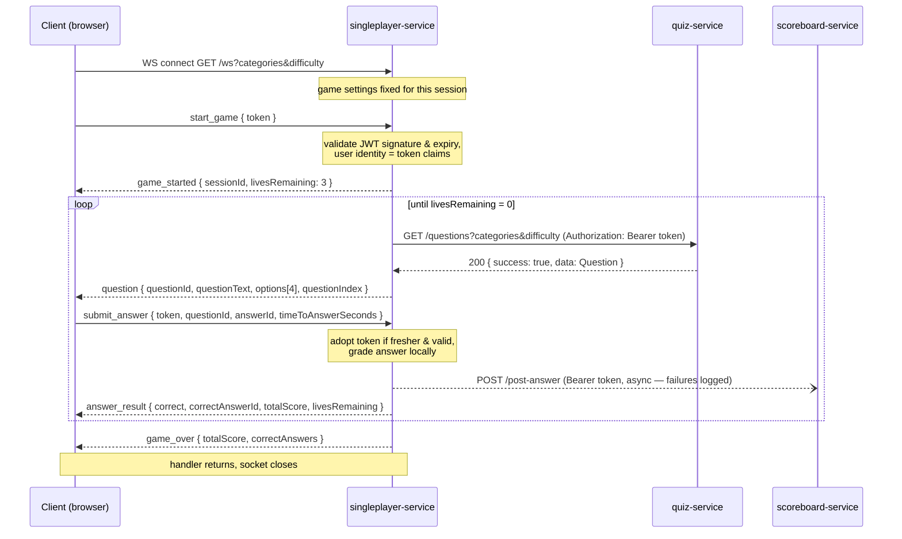

# API Contracts — team16-quiz-app backend

Status: **implemented** (backend; the frontend still has to adopt the new shapes).
This document is the single source of truth for data formats between the four
backend services (and the frontend). Where code disagrees with this document,
the code is wrong.

Services (host ports as mapped in `docker-compose.yaml`):

| Service | Container port | Host port | Talks to |
|---|---|---|---|
| auth-service | 3000 | 3000 | — |
| quiz-service | 3000 | 4000 | OpenTDB (external) |
| scoreboard-service | 3000 | 5000 | — |
| singleplayer-service | 3000 | 6000 | quiz-service, scoreboard-service |

---

## 1. Global conventions

### 1.1 Entity IDs are UUIDs

Every entity is identified by a UUID (v4, serialized as the canonical lowercase
hyphenated string, e.g. `"550e8400-e29b-41d4-a716-446655440000"`):

| Entity | Owned by | Notes |
|---|---|---|
| user | auth-service | already UUID |
| question | quiz-service | `uuid` (migrated from `SERIAL`/i32) |
| answer record | scoreboard-service | already UUID |
| duel | scoreboard-service | already UUID |
| session | singleplayer-service | full `Uuid::new_v4()`, **no** `sess_` prefix / truncation |

**Answer options are NOT entities.** An answer option is identified by its 1-based
integer index within its question (see §1.2). Never UUID, never a prefixed string
like `"a_1"`.

### 1.2 Canonical answer-option order

For a question, the option list is: all four option texts (`correctAnswer` +
`incorrectAnswers`) sorted lexicographically by Unicode code point, ascending.
`answerId` / `correctAnswerId` is the **1-based index** into that sorted list
(type: integer, 1–4). Every service derives the same index from the same
question data; no service may shuffle.

### 1.3 JSON field naming

All JSON fields are **camelCase** (`questionId`, `incorrectAnswers`,
`timeToAnswerSeconds`). In Rust: `#[serde(rename_all = "camelCase")]` on every
request/response struct.

### 1.4 Response envelope

Every HTTP endpoint (except `/health`) wraps its response:

```jsonc
// 2xx
{ "success": true, "data": { /* payload, may be an object or array */ } }

// 4xx / 5xx
{ "success": false, "error": { "message": "human-readable reason" } }
```

Status codes carry the semantics: `200` read OK, `201` created, `401` missing or
invalid token, `403` valid token but insufficient role, `404` not found,
`409` conflict, `422` body failed validation, `500` internal error.

### 1.5 Health endpoints

`GET /health` on every service, **no auth, no envelope**:

```json
{ "status": "healthy" }
```

### 1.6 Timestamps and durations

- Timestamps: RFC 3339 / ISO 8601 strings in UTC, e.g. `"2026-06-11T14:30:00Z"`
  (`chrono::DateTime<Utc>` default serde format).
- Durations: integer **seconds**, field names suffixed `Seconds`
  (`timeToAnswerSeconds`). Type: `i32` on the wire and in the DB.

---

## 2. Authentication

### 2.1 Model

Every endpoint except `/health`, `/login`, `/register`, `/refresh` requires:

```
Authorization: Bearer <accessToken>
```

There are **no service accounts**. When service A calls service B on behalf of a
user, A forwards the user's own token unchanged (token pass-through). All
services share `JWT_SECRET` and validate tokens locally with `shared::jwt`.

### 2.2 JWT claims

```jsonc
{
  "id":    "<user uuid>",
  "email": "user@example.com",
  "role":  "User" | "Admin",
  "exp":   1765465200          // unix seconds
}
```

- Access-token TTL: **15 minutes**.
- The `user_id` stored by any service MUST come from the token claims, never
  from a request body.

### 2.3 Refresh flow (stateless re-issue)

`POST /refresh` on auth-service. The client presents its current access token
(valid **or expired for less than 60 minutes**) in the `Authorization` header;
auth-service verifies the signature, ignores `exp` within that grace window, and
returns a newly signed token with the same claims and a fresh `exp`.

- No refresh-token table, no revocation; logout is client-side token deletion.
  (Accepted trade-off; revisit if revocation is ever needed.)
- Tokens expired beyond the grace window → `401`, client must log in again.
- Frontend behavior: on any `401` from any service, call `/refresh` once and
  retry; if refresh also fails, redirect to login.

### 2.4 WebSocket auth (singleplayer)

A browser WebSocket cannot set headers, so:

- `start_game` carries the access token; singleplayer validates it and takes
  `userId` from the claims (the client never sends a bare `userId`).
- Every `submit_answer` also carries the client's **current** token. Singleplayer
  always forwards the most recently received valid token to scoreboard-service,
  so a refresh mid-game propagates automatically.

---

## 3. auth-service

### POST /register — no auth

Request:

```json
{ "email": "a@b.com", "password": "secret", "username": "alice" }
```

Responses: `201` `{ "success": true, "data": { "token": "<jwt>" } }` ·
`409` email already registered.

### POST /login — no auth

Request:

```json
{ "email": "a@b.com", "password": "secret" }
```

Responses: `200` `{ "success": true, "data": { "token": "<jwt>" } }` ·
`401` invalid credentials.

> Note: `/register` and `/login` return the **identical** success shape. (Fixes
> the current split where login hides the token in `data.message`.)

### POST /refresh — expired-token tolerant (§2.3)

Headers: `Authorization: Bearer <token>` (valid or ≤60 min expired).
Responses: `200` `{ "success": true, "data": { "token": "<jwt>" } }` · `401`.

### GET /me — auth

`200` `{ "success": true, "data": { "id": "<uuid>", "email": "…", "role": "User" } }`

---

## 4. quiz-service

All endpoints require auth (§2.1).

### GET /questions — auth (any role)

Returns one random question, optionally filtered.

Query parameters (both optional, combinable):

| Param | Format | Semantics |
|---|---|---|
| `categories` | comma-separated exact category names, e.g. `categories=Science: Computers,History` | the question's category must be **one of** the listed values (OR). Names must exactly match the stored OpenTDB categories (case-sensitive); empty entries are ignored; unknown names simply never match |
| `difficulty` | `easy` \| `medium` \| `hard` | exact match |

```sh
curl -s -G "http://localhost:4000/questions" \
  --data-urlencode "categories=Science: Computers,History" \
  --data-urlencode "difficulty=easy" \
  -H "Authorization: Bearer $TOKEN"
```

```jsonc
// 200
{
  "success": true,
  "data": {
    "questionId": "<uuid>",
    "category": "Science: Computers",
    "difficulty": "medium",            // "easy" | "medium" | "hard"
    "question": "What does CPU stand for?",
    "correctAnswer": "Central Processing Unit",
    "incorrectAnswers": ["Central Process Unit", "Computer Personal Unit", "Central Processor Unit"]
  }
}
```

`404` if the questions table is empty **or no question matches the given
filters**.

> `questionId` is never optional and never derived (no hash fallback in
> consumers). DB schema: `id uuid DEFAULT gen_random_uuid() PRIMARY KEY`.

### POST /scrape — auth, **Admin role only**

Triggers a manual OpenTDB scrape. `200`
`{ "success": true, "data": { "message": "Scrape triggered" } }` · `403` non-admin.

---

## 5. scoreboard-service

All endpoints require auth (§2.1).

### POST /post-answer — auth

Records one answer for the **authenticated** user (`userId` is taken from the
token; it does not appear in the body).

Request:

```jsonc
{
  "questionId": "<uuid>",
  "answerId": 3,                          // 1-based option index, §1.2
  "isCorrect": true,
  "timestamp": "2026-06-11T14:30:00Z",
  "timeToAnswerSeconds": 4,
  "isMultiplayer": false,
  "sessionId": "<uuid>"
}
```

Response: `201` `{ "success": true, "data": { "answerRecordId": "<uuid>" } }`

### POST /duel-results — auth

Request:

```jsonc
{
  "sessionId": "<uuid>",
  "hostUserId": "<uuid>",
  "guestUserId": "<uuid>",
  "hostScore": 300,
  "guestScore": 200,
  "timestamp": "2026-06-11T14:30:00Z"
}
```

Response: `201` `{ "success": true, "data": { "duelId": "<uuid>" } }`

### GET /user-duels?userId=\<uuid\> — auth

`200` `{ "success": true, "data": [ { "duelId": "…", "sessionId": "…", "hostUserId": "…", "guestUserId": "…", "hostScore": 300, "guestScore": 200, "timestamp": "…" } ] }`

### GET /question-stats?questionId=\<uuid\> — auth

```jsonc
// 200
{
  "success": true,
  "data": {
    "questionId": "<uuid>",
    "totalAnswers": 40,
    "questionType": "Multiple",          // "Multiple" | "TrueFalse"
    "correctAnswerId": 2,                // integer index; 0 = unknown
    "options": [
      { "answerId": 1, "percentage": 25.0 },
      { "answerId": 2, "percentage": 75.0 }
    ]
  }
}
```

`404` if no answers recorded. `answerId`/`correctAnswerId` are integers.

---

## 6. singleplayer-service (WebSocket)

`GET /ws` upgrades to a WebSocket. Optional query parameters on the upgrade
URL fix the session's game settings **at the moment the socket opens**
(changing them requires a new connection):

| Param | Format |
|---|---|
| `categories` | comma-separated category names, forwarded verbatim to quiz-service (§4) |
| `difficulty` | `easy` \| `medium` \| `hard` |

Example: `ws://localhost:6000/ws?categories=Science%3A%20Computers,History&difficulty=easy`

All messages are JSON with a `type` tag.

### Client → server

```jsonc
{ "type": "start_game", "token": "<jwt>" }

{
  "type": "submit_answer",
  "token": "<jwt>",                 // client's CURRENT token, §2.4
  "questionId": "<uuid>",
  "answerId": 3,                    // integer index, §1.2
  "timeToAnswerSeconds": 4
}
```

### Server → client

```jsonc
{ "type": "game_started", "sessionId": "<uuid>", "livesRemaining": 3 }

{
  "type": "question",
  "questionId": "<uuid>",
  "questionText": "What does CPU stand for?",
  "options": [ { "id": 1, "text": "Central Process Unit" }, { "id": 2, "text": "Central Processing Unit" } /* … */ ],
  "questionIndex": 1
}

{ "type": "answer_result", "correct": true, "correctAnswerId": 2, "totalScore": 100, "livesRemaining": 3 }

{ "type": "game_over", "totalScore": 300, "correctAnswers": 3 }

{ "type": "error", "message": "expected start_game message" }
```

### Outbound calls

| Call | Contract | Auth |
|---|---|---|
| `GET {QUIZ_SERVICE_URL}/questions?categories=…&difficulty=…` (session settings, omitted when unset) | §4 | forward user token |
| `POST {SCOREBOARD_SERVICE_URL}/post-answer` | §5 | forward user token |

Non-2xx responses from either service MUST be logged with status and body
(no silent fire-and-forget).

### Messaging flow



Lifecycle rules:

1. The **first** client message must be `start_game`. Anything else (or an
   invalid/expired token) → `error` message, connection ends.
2. After `game_started`, the server drives the loop: it always sends a
   `question` and then waits for exactly one `submit_answer`.
3. `submit_answer.questionId` must echo the current question's id; a mismatch
   → `error`, connection ends.
4. Scoring: correct answer **+100** points; wrong answer **−1 life**. The game
   starts with **3 lives** and ends with `game_over` when they reach 0. There
   is no question limit and no per-question timeout (the client measures
   `timeToAnswerSeconds` itself).
5. Grading is local: singleplayer compares `answerId` against the canonical
   index (§1.2). The scoreboard POST is fire-and-forget — a scoreboard outage
   never interrupts a running game (failures are logged, not surfaced).
6. If quiz-service is unreachable or returns non-2xx, the client receives
   `error` and the connection ends. Note that overly narrow session settings
   (e.g. a rare category + `hard`) make quiz-service's 404 a *user-reachable*
   state — the game then ends with an `error` right after `game_started`.
7. Token refresh mid-game: the client refreshes via auth-service `/refresh`
   over HTTP as usual and simply includes the new token in its next
   `submit_answer` (§2.4). Invalid replacement tokens are ignored (logged);
   the previous token stays in use.

---
